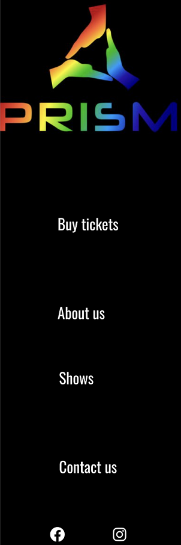
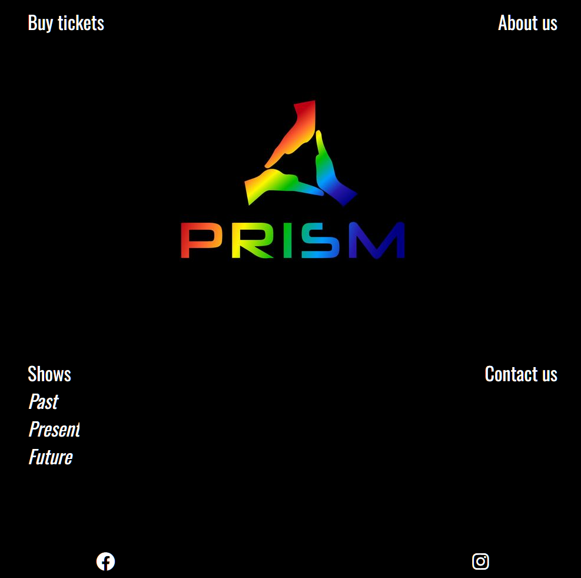
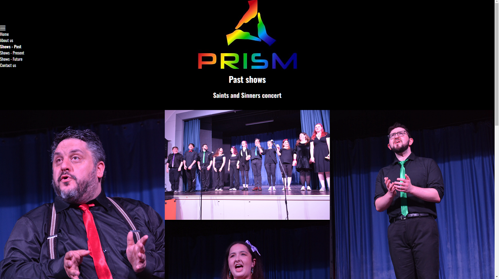
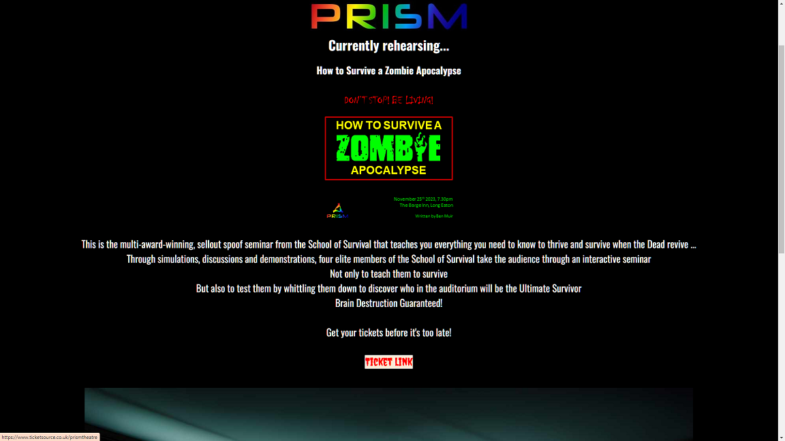
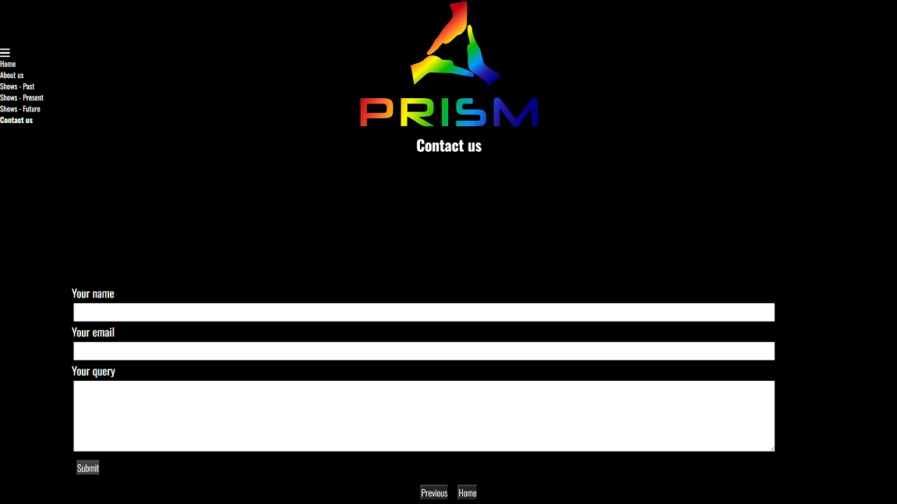
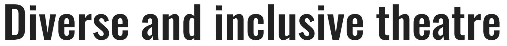

# Prism Theatre website

# Prism Theatre
The website is for the amateur dramatic company Prism Theatre. It allows people to buy tickets for upcoming performances, learn about the company and their past, present, future shows. It gives the company a central hub where they can provide information, sell tickets and promote their shows.
The GitHub page can be accessed [here](https://github.com/elamont174/prismtheatre/).
The deployed link can be accessed [here](https://elamont174.github.io/prismtheatre/).

# User Stories
The target audience for the website will be people, most likely adults, who wish to attend the theatre in the Nottingham area of England. The most likely user will be considering buying tickets for a show or wishing to become involved in local amateur dramatics in the area. User stories are therefore likely to include:
- As a theatre goer, I want to buy tickets quickly and easily.
- As a theatre goer, I want to know that the company is legit, has experience and that I won't be wasting my money.
- As a theatre goer, I am curious about the company and what other shows they have performed in the past
- As a local theatre goer, I want to know if I recognise any of the actors, to lend credence to the company. 
- As a ticket purchaser, I want to be able to contact the company by either email or social media in case I have questions about a performance.
- As an actor, I want to know if I can contact the company to get involved.
  

# Features

## Home Page 
- The home page has the company logo at the heart. The home page design is responsive: on mobile, the different pages are listed underneath in a column, whereas for larger screens the pages are linked around the edges.
- 
- The company social media pages are linked in the footer of the homepage - these can be accessed by clicking the Facebook and Instagram logos, which open as new tabs. 
- If you hover over the 'Shows' link, you can choose between past, present or future show pages. 
- 

## About us page
The About Us page contains:
- a hero image of the company at a past concert.
- the company manifesto.
- quick navigation buttons at the button of the page and a navigation area at the top left of the page.

The hero image is a background image which doesn't move but of which more will be displayed depending on which size of screen is used. The text is across the hero image and is responsive to screen size.

## Past shows gallery
The past shows page contains:
- a photo gallery of a past concert the group has performed.
- quick navigation buttons at the button of the page and a navigation area at the top left of the page.
- 

The gallery is responsive so that on mobile, there is one column of photos; on larger/landscape mobiles there are two columns of photos; on tablets/desktops there are three columns of photos. It it presented in a masonic layout to provide visual interest to the user. All photos have alt text so that, if an image link breaks or someone is using a screen reader, there is alternative text to read if necessary. 

## Current show page
The current show page contains:
- an image of the poster the group are currently rehearsing.
- information about the show.
- a link to the ticket page for users to buy tickets.
- an image of the cast in costume for the show.
- quick navigation buttons at the button of the page and a navigation area at the top left of the page.
- 

## Future shows page
The future shows page contains:
- an image of a poster for the show which the group will be performing in the future.
- a link to the ticket page (accessed by clicking on the image of the poster).
- quick navigation buttons at the button of the page and a navigation area at the top left of the page.

## Contact us form page
  A form was created using the form function. 
  This included:
  - A text input where the user's name is required.
  - An email input where the user's email is required.
  - A text-area input where the user can put their query as a required option.
  - The submit button which currently pushed the query to the Code Institute's form-dump page and shows the user what data was sent. 
- 

# Technologies used
- [HTML](https://codeinstitute.net/blog/what-is-html-and-why-should-i-learn-it/) 
- [CSS](https://codeinstitute.net/blog/what-is-css-and-why-should-i-learn-it/)
- [Balsamiq](https://balsamiq.com/)
- [GitHub](https://github.com/)

# Design
The design was entirely focused around the Prism Theatre logo and principles:
- 
The Prism Theatre logo has a black background with a rainbow spectrum of colours as the central design - aligning with the name 'Prism'. Prism's values are diversity and inclusivity so all decisions were made with this in mind.
A deliberately uncluttered design was used to reduce cognitive overload; alt labels were used for all pictures and aria labels were used wherever links opened to new pages to improve the experience of people using screen readers. 
A black background was chosen to blend in with the background of the Prism logo and the logo was placed at the top of each page to ensure consistency. A white font was used as the most contrasting font against black to make the font easy to read. Sans-serif fonts are considered to be the easiest fonts to read by people who have autism or dyslexia so the sans-serif font 'Oswald' was chosen as the consistent font throughout the website: 
- 
The only outlier to this was for the "How to Survive a Zombie Apocalypse" ticket link where a red 'Creepster' font was used to add interest and a spooky feel. 

## Wireframes
- 
- 
- 
- 
- 
- 
- 

# Testing
Please see [TESTING.md file](TESTING.md)

## Bugs
1. On the homepage, used flexbox to group the 'shows' and 'contact us' links together and then move them to underneath the logo when on larger screens. Since 'Shows' has a drop-down, this meant that the 'Contact us' box would move when the dropdown was open. I have set the flexbox to 'center' which meant that when the dropbox was open, 'contact us' was moving to the new center. I fixed this by changing the flexbox to 'flex-start' instead. 
2. When I created the navigation tabs on the individual pages, the dropdown was causing the content of the entire page to move down. I corrected this by setting the positioning of the page to absolute and the dropdown to relative so that the dropdown was then positioned over the page and not causing the page to move down. 
3. I initially nested anchor tags inside of buttons as I didn't realise that HTML wouldn't allow this. I fixed this by changing all buttons into forms and with a 'get' method. 

# Deployment
The site was deployed to GitHub. The link can be found [here](https://elamont174.github.io/prismtheatre/)

# Future improvements
- The website has been made with the intention of being cloned for use by Prism Theatre. 
- The contact form would be made fully functional so that the user's query would be directed to Prism Theatre's email address.
- As more shows are performed, the 'past/present/future' show pages would need to be updated appropriately. Moving forward, each show will have it's own page created for it so that it can easily be link ed from place to place, depending on what time frame is appropriate. The site would need to be maintained to allow this. The structure of the 'past shows' gallery would be altered tobe a central hub where these pages would link from. 

# Credits
- [FreeCodeCamp](https://www.freecodecamp.org/news/html-drop-down-menu-how-to-add-a-drop-down-list-with-the-select-element/) was consulted to create the dropdown menu on the home page.
- [cloudconvert](https://cloudconvert.com/webp-converter) was used to convert images to webp files.
- [Font Awesome](https://fontawesome.com/) was used for the social media symbols on the home page.
- [Balsamiq](https://balsamiq.com/) was used to create wireframes.
- [Google fonts](https://fonts.google.com/) was used for the font. 
- [MarkdownConvert](https://markdown-convert.com/en/tool/table) was used to create the manual testing markdown table 
- Andy Chick took all of the photos in the past shows gallery and the current show page - they are used with his permission.
- Kim-louise Sparks created the posters on the current shows and future shows pages - they are used with her permission.

# Acknowledgements
- My mentor Aleksei Konovalov was a great source of support and helped me work out how to make the home page responsive in the manner I wanted.
- My husband Malcolm Lamont gave me a layman's viewpoint and kept me sane throughout.
- The team at Prism Theatre, especially Kim-louise Sparks, Victoria Bryan and Matt McAuley, let me take our vision and bring it to life - and also gave me permission to use the company name/photos/plans for my project! 