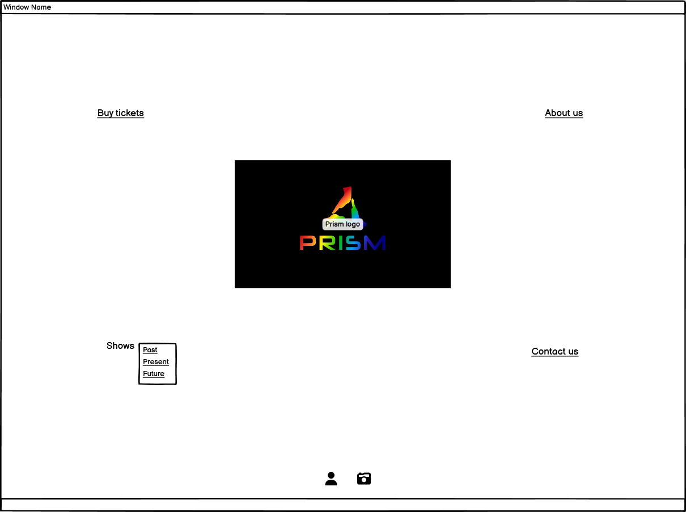

# Prism Theatre website

# Prism Theatre
The website is for the amateur dramatic company Prism Theatre. It allows people to buy tickets for upcoming performances, learn about the company and their past, present, future shows. It gives the company a central hub where they can provide information, sell tickets and promote their shows.
The GitHub page can be accessed [here](https://github.com/elamont174/prismtheatre/)
The deployed link can be accessed [here](https://elamont174.github.io/prismtheatre/)

# User Stories

- As a theatre goer, I want to buy tickets quickly and easily.
- As a theatre goer, I want to know that the company is legit, has experience and that I won't be wasting my money.
- As a theatre goer, I am curious about the company and what other shows they have performed in the past
- As a local theatre goer, I want to know if I recognise any of the actors, to lend credence to the company. 
- As a ticket purchaser, I want to be able to contact the company by either email or social media in case I have questions about a performance.
- As an actor, I want to know if I can contact the company to get involved.
  

# Features

## Home Page 

## About us page

## Past shows gallery

## Current show page

## Future shows page

## Contact us form page

# Technologies used

# Design

## Wireframes

- 
- 
- 
- 
- 
- 
- 

# Testing

# Deployment
The link can be found [here](https://elamont174.github.io/prismtheatre/">https://elamont174.github.io/prismtheatre/)

# Future improvements

# Credits

- <a href="https://www.freecodecamp.org/news/html-drop-down-menu-how-to-add-a-drop-down-list-with-the-select-element/">FreeCodeCamp</a> was used to create the dropdown menu on the home page.
- <a href="https://cloudconvert.com/webp-converter">cloudconvert</a> was used to convert images to webp files.
- <a href="https://fontawesome.com/">Font Awesome</a> was used for the social media symbols on the home page.
- <a href="https://balsamiq.com/">Balsamiq</a> was used to create wireframes.
- Andy Chick took all of the photos in the past shows gallery and the current show page - they are used with his permission.
- Kim-louise Sparks created the posters on the current shows and future shows pages - they are used with her permission.

# Acknowledgements