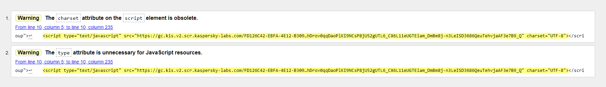
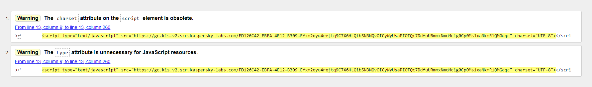
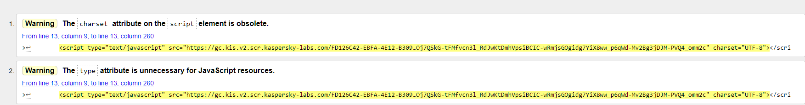
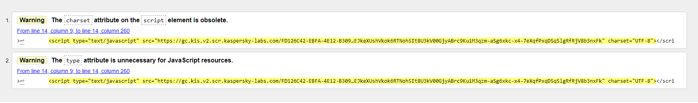
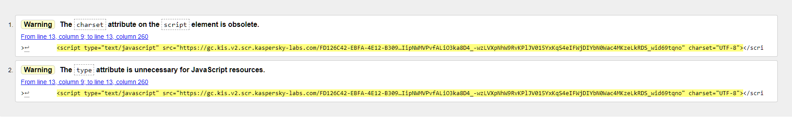
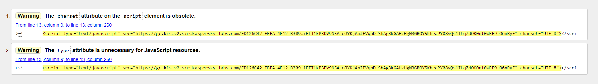
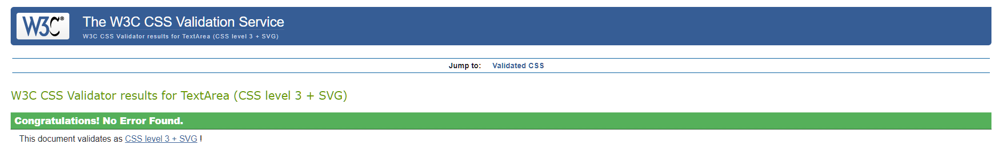

# Testing

- I tested that the website works on Chrome and Microsoft Edge.
- I used devtools to check the responsiveness; I also checked this on the deployed site with my personal desktop computer and mobile phone.

## Manual testing
|Feature|Action|Expected result|Actual result|
|:----|:----|:----|:----|
|Interactive word on home page|Click "Buy tickets"|Opens external link to Ticketsource|As expected|
|Interactive word on home page|Click "About us"|Opens internal link to About Us page|As expected|
|Interactive word on home page|Hover over "Shows"|Dropdown menu appears|As expected|
|Interactive word on home page|Click "Past"|Opens internal link to Past shows page|As expected|
|Interactive word on home page|Click "Present"|Opens internal link to Future shows page|As expected|
|Interactive word on home page|Click "Future"|Opens internal link to Future shows page|As expected|
|Interactive word on home page|Click "Contact us"|Opens internal link to Contact Us page|As expected|
|Facebook icon on home page|Click Facebook icon|Opens external link to Facebook|As expected|
|Instagram icon on home page|Click Instagram icon|Opens external link to Instagram|As expected|
|Home button on about us page|Click Home button|Opens internal link to Home page|As expected|
|Next button on about us page|Click Next button|Opens internal link to Past shows page|As expected|
|Navbar on about us page|Hover over hamburger|Dropdown menu appears|As expected|
|Navbar links on about us page|Click on each link |Opens internal link to relevant page|As expected for all|
|Previous button on past shows page|Click Previous button|Opens internal link to About Us page|As expected|
|Home button on past shows page|Click Home button|Opens internal link to Home page|As expected|
|Next button on past shows page|Click Next button|Opens internal link to Past shows page|As expected|
|Navbar on about us page|Hover over hamburger|Dropdown menu appears|As expected|
|Navbar links on past shows page|Click on each link |Opens internal link to relevant page|As expected for all|
|Previous button on current shows page|Click Previous button|Opens internal link to Past shows page|As expected|
|Home button on current shows page|Click Home button|Opens internal link to Home page|As expected|
|Next button on current shows page|Click Next button|Opens internal link to Future shows page|As expected|
|Navbar on about us page|Hover over hamburger|Dropdown menu appears|As expected|
|Navbar links on current shows page|Click on each link |Opens internal link to relevant page|As expected for all|
|Ticket link on current shows page|Click on Ticket Link|Opens external link to Ticketsource|As expected|
|Previous button on future shows page|Click Previous button|Opens internal link to Current shows page|As expected|
|Home button on future shows page|Click Home button|Opens internal link to Home page|As expected|
|Next button on future shows page|Click Next button|Opens internal link to Contact Us page|As expected|
|Navbar on about us page|Hover over hamburger|Dropdown menu appears|As expected|
|Navbar links on future shows page|Click on each link |Opens internal link to relevant page|As expected for all|
|Poster on future shows page|Click on poster|Opens external link to Ticketsource|As expected|
|Previous button on contact us page|Click Previous button|Opens internal link to Future shows page|As expected|
|Home button on contact us page|Click Home button|Opens internal link to Home page|As expected|
|Navbar on about us page|Hover over hamburger|Dropdown menu appears|As expected|
|Navbar links on contact us page|Click on each link |Opens internal link to relevant page|As expected for all|
|Your name" text box|Type your name into the text box|Text will appear in the box, required field|As expected
"Your email" text box|Type your email into the text box|Text will appear in the box, required field -  must have an @ sign|As expected
"Your query" text box|Type your query into the text box|Text will appear in the box, required field|As expected
Submit button|Click submit when your form is complete|The form will not submit until all the fields have been filled in and the requirements met|When submit is pressed, a form will be fed back showing what details the user has inputted|	As expected|

## HTML validator

### Homepage/index.html
- The warnings were for the Font Awesome icons script.
- 

### About us page
- The warnings were for the Font Awesome icons script.
- 

### Past shows gallery
- The warnings were for the Font Awesome icons script.
- 

### Current show page
- The warnings were for the Font Awesome icons script.
- 

### Future shows page
- The warnings were for the Font Awesome icons script.
- 

### Contact us page
- The warnings were for the Font Awesome icons script.
- 
  
## CSS validator

- 

