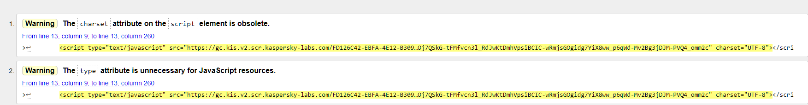

# Testing

- I tested that the website works on Chrome and Microsoft Edge.
- I used devtools to check the responsiveness; I also checked this on the deployed site with my personal desktop computer and mobile phone.

## HTML validator

### Homepage/index.html
- The warnings were for the Font Awesome icons script.
- 

### About us page
- The warnings were for the Font Awesome icons script.
- 

### Past shows gallery
- The warnings were for the Font Awesome icons script.
- 

### Current show page
- The warnings were for the Font Awesome icons script.
- 

### Future shows page
- The warnings were for the Font Awesome icons script.
- 

### Contact us page
- The warnings were for the Font Awesome icons script.
- 
  
## CSS validator

- 
